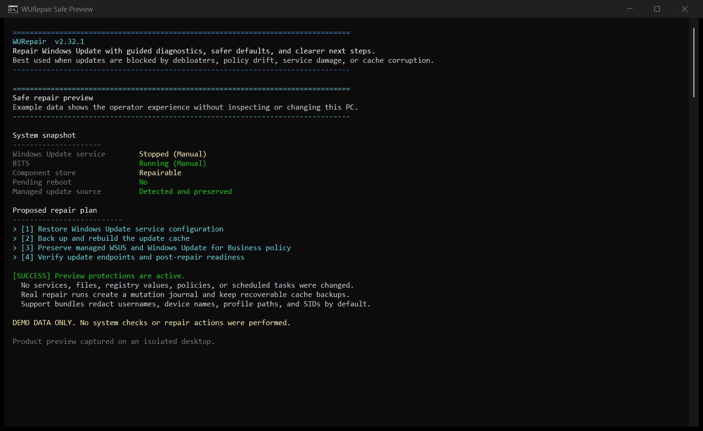

<p align="center">
  
</p>

<h1 align="center">WURepair</h1>

<p align="center">
  Diagnose a broken Windows Update stack, preview the repair plan, and keep the evidence needed to recover.
</p>

<p align="center">
  
  
  
  
</p>



Windows Update can fail after a debloat pass, damaged services, policy drift, a corrupt cache, or component-store trouble. WURepair turns that failure into an operator-readable diagnosis and a deliberate repair path.

The script checks readiness before it changes anything. It protects managed WSUS and Windows Update for Business settings by default, records repair phases, and keeps rollback evidence for the changes it can reverse.

## Why operators use it

| | What you get |
|---|---|
| **Evidence before action** | Service state, cache health, DISM status, pending reboot, BitLocker posture, update errors, WinRE, and endpoint reachability in one pass. |
| **A real preview** | `-WhatIf` shows the diagnostics-backed plan without running repair phases. `-Demo` shows the interface without inspecting the PC. |
| **Policy-aware repair** | Managed update sources remain protected unless `-ResetManagedUpdatePolicy` is supplied explicitly. |
| **Recovery records** | Cache backups, a mutation journal, restore-point outcomes, JSON, HTML, logs, and redacted support bundles. |

## Start safely

Download the script or module ZIP from the [latest release](https://github.com/SysAdminDoc/WURepair/releases/latest), then extract it to a working folder.

### 1. Try the product with demo data

Demo mode needs no administrator rights. It performs no system checks and no repair actions.

```powershell
powershell -NoProfile -ExecutionPolicy Bypass -File .\WURepair.ps1 -Demo
```

Generate the matching local report:

```powershell
powershell -NoProfile -ExecutionPolicy Bypass -File .\WURepair.ps1 -Demo -HtmlReport .\WURepair-demo.html
```

### 2. Preview the plan for this PC

Open PowerShell as administrator, then run:

```powershell
powershell -NoProfile -ExecutionPolicy Bypass -File .\WURepair.ps1 -WhatIf -JsonReport .\WURepair-preview.json
```

This gathers real diagnostics and writes the proposed phases. It does not run the repair phases.

### 3. Choose a targeted or full repair

Repair services and the update cache:

```powershell
powershell -NoProfile -ExecutionPolicy Bypass -File .\WURepair.ps1 -RepairServices -RepairStore
```

Run the full guided repair:

```powershell
powershell -NoProfile -ExecutionPolicy Bypass -File .\WURepair.ps1
```

Actual repair runs require administrator rights. DISM and SFC can take 20 to 45 minutes. Restart Windows before judging the final result.

## What WURepair checks and repairs

| Area | Diagnosis | Repair path |
|---|---|---|
| Update services | Windows Update, BITS, Cryptographic Services, Delivery Optimization, WaaSMedic, and Update Orchestrator | Restore start types, dependencies, service state, and disabled USO tasks |
| Update stores | SoftwareDistribution, catroot2, Delivery Optimization cache, and pending operations | Back up and rebuild damaged caches |
| Windows servicing | DISM health, component-store cleanup opportunity, SFC, WinRE, and Quick Machine Recovery | RestoreHealth, gated component cleanup, SFC, and optional SSU staging |
| Network path | Microsoft endpoints, hosts file, proxy, Winsock, TCP/IP, firewall, and TLS | Remove verified blocks and repair update connectivity |
| Policy | WSUS, SUP, Windows Update for Business, dual scan, and UI restrictions | Remove blocking values while preserving managed sources by default |
| Update evidence | WindowsUpdate.log, ETW conversion, HRESULT ranking, event logs, and pending updates | Export a structured timeline, HTML, JSON, and a redacted support bundle |

## Safety model

- A readiness gate checks pending reboot and BitLocker risk before unattended repair continues.
- Managed WSUS, SUP, and Windows Update for Business source policy is preserved unless you use `-ResetManagedUpdatePolicy`.
- Store repair backs up cache folders unless `-SkipBackup` is supplied.
- Hosts, registry, policy, and cache mutations are written to a per-run journal.
- `-RollbackJournal <path>` previews reversible entries. Add `-ApplyRollback` only when you are ready to restore them.
- Restore-point attempts and outcomes appear in JSON reports and support-bundle manifests.
- DISM `/ResetBase` runs only when cleanup is recommended and at least 1024 MB is reclaimable.
- Support bundles redact usernames, device names, profile paths, and SIDs unless `-NoRedact` is supplied.

Some Windows repair operations cannot be undone. Read the preview, keep the journal, and use a tested device backup for important systems.

## Reports and automation

WURepair works as an interactive repair tool, an RMM-friendly script, or an Intune proactive remediation package.

| Output | Use |
|---|---|
| `-JsonReport <path>` | Machine-readable options, readiness, phases, before and after diagnostics, and exit code |
| `-HtmlReport <path>` | Portable local report for technicians, tickets, or escalation |
| `-SupportBundle <path>` | Redacted ZIP with logs, reports, event exports, and CBS or DISM tails |
| `-WUfBDiagnostics <path>` | Windows Update for Business diagnostic bundle |
| `-TranscriptPath <path>` | Plain execution transcript for remote tooling |
| `-PlainText` | Deterministic ASCII output for RMM consoles and screen readers |
| `-Unattended` | No prompts or progress UI, with stable process exit codes |

### Unattended exit codes

| Code | Meaning |
|---:|---|
| `0` | Success |
| `10` | Completed with warnings |
| `20` | One or more repair phases reported errors |
| `30` | Repair completed, but endpoint verification still failed |
| `40` | Administrator rights are missing |
| `50` | Repair was cancelled before execution |

## Common repair recipes

```powershell
# Fast pass without DISM or SFC
.\WURepair.ps1 -Quick

# Rebuild update services and stores
.\WURepair.ps1 -RepairServices -RepairStore -RepairDLLs

# Use mounted Windows media for DISM with no online fallback
.\WURepair.ps1 -RepairDISM -DismSource D:\sources\install.wim -DismLimitAccess

# Inspect recent Windows Update errors and export JSON
.\WURepair.ps1 -AnalyzeLogs -JsonReport C:\Temp\WURepair-report.json

# List updates visible to the Windows Update Agent
.\WURepair.ps1 -ListPending

# Reset WSUS client identity without removing WSUS policy
.\WURepair.ps1 -ResetWSUSClient -JsonReport C:\Temp\WSUS-reset.json

# Create a redacted escalation bundle
.\WURepair.ps1 -SupportBundle C:\Temp\WURepair-support.zip

# Preview a previous journal, then apply only after review
.\WURepair.ps1 -RollbackJournal C:\Temp\WURepair_Journal.json
.\WURepair.ps1 -RollbackJournal C:\Temp\WURepair_Journal.json -ApplyRollback
```

## Full command reference

<details>
<summary>Show every supported option</summary>

| Option | Purpose |
|---|---|
| `-Demo` | Show realistic sample output without checking or changing the PC |
| `-Help` | Show built-in help |
| `-Quick` | Skip DISM and SFC for a faster repair pass |
| `-SkipDISM` | Skip DISM only |
| `-SkipSFC` | Skip System File Checker only |
| `-SkipBackup` | Skip extra update-store backups |
| `-RepairServices` | Restore Windows Update service configuration |
| `-RepairDLLs` | Re-register Windows Update components |
| `-RepairStore` | Rebuild SoftwareDistribution and catroot2 |
| `-RepairDISM` | Run DISM component-store repair |
| `-RepairSFC` | Run System File Checker |
| `-RepairNetwork` | Repair the update network path |
| `-RepairWaaS` | Reset Update Orchestrator services and tasks |
| `-RepairDelivery` | Reset Delivery Optimization cache and policy |
| `-RepairServicingStack` | Download, validate, and install an applicable Catalog SSU |
| `-ResetPolicies` | Remove blocking update policies while protecting managed sources |
| `-RepairAll` | Select the full repair pipeline |
| `-StageSSU` | Stage an applicable Servicing Stack Update before DISM |
| `-DismSource <path>` | Use mounted Windows media, `install.wim`, or `install.esd` for RestoreHealth |
| `-DismLimitAccess` | Prevent DISM from falling back to Windows Update |
| `-AnalyzeLogs` | Export a structured Windows Update log timeline |
| `-ListPending` | List visible, not-installed software updates |
| `-ResetWSUSClient` | Reset WSUS client identity and request fresh authorization |
| `-JsonReport <path>` | Write a machine-readable repair report |
| `-HtmlReport <path>` | Write a portable local HTML report |
| `-SupportBundle <path>` | Create a redacted escalation ZIP |
| `-WUfBDiagnostics <path>` | Create a Windows Update for Business diagnostic ZIP |
| `-TranscriptPath <path>` | Write a PowerShell transcript |
| `-JournalPath <path>` | Choose the mutation journal path |
| `-RollbackJournal <path>` | Preview reversible entries from a prior journal |
| `-ApplyRollback` | Apply reversible entries with `-RollbackJournal` |
| `-ResetManagedUpdatePolicy` | Intentionally remove managed update-source policy |
| `-OverrideReadinessBlock` | Let unattended repair continue past a recorded readiness block |
| `-NoRedact` | Keep device and identity details in support output |
| `-PlainText` | Use deterministic ASCII output without progress rendering |
| `-Unattended` | Suppress prompts and return automation exit codes |
| `-WhatIf` | Gather diagnostics and preview planned repair phases |
| `-InSafeMode` | Confirm Safe Mode and enable deeper locked-file cleanup |

</details>

## Intune proactive remediation

The `Intune` folder contains separate detection and remediation scripts.

1. Place `WURepair.ps1` at `%ProgramData%\WURepair\WURepair.ps1` on managed devices.
2. Upload `Intune\Detect-WURepair.ps1` as the detection script.
3. Upload `Intune\Remediate-WURepair.ps1` as the remediation script.
4. Run in 64-bit PowerShell as SYSTEM, not as the signed-in user.

Detection returns `0` for compliant devices and `1` when remediation is needed. Remediation writes its JSON report and mutation journal under `%ProgramData%\WURepair\Reports`.

## Requirements

- Windows 10 or Windows 11, including LTSC and IoT editions
- Windows PowerShell 5.1 or later
- Administrator rights for real diagnostics and repair
- At least 5 GB free space, with 10 GB preferred for servicing work

## Verify a release

Each release publishes two ZIPs, a release receipt, and a SHA256 manifest. The ZIPs also contain per-file checksums and a file catalog when the current Windows host supports catalog creation.

```powershell
certutil -hashfile .\WURepair-script-v2.32.1.zip SHA256
certutil -hashfile .\WURepair-module-v2.32.1.zip SHA256
```

Compare both values with `WURepair-v2.32.1-SHA256SUMS.txt`. Release scripts are not Authenticode-signed unless the release notes say otherwise.

## Build and test

Run the complete local gate:

```powershell
.\Invoke-LocalChecks.ps1
```

Build and verify both release packages:

```powershell
.\tools\Build-WURepairPackage.ps1
.\tools\Test-WURepairPackage.ps1 -PackageRoot .\dist
```

Signing is optional when building locally:

```powershell
.\tools\Build-WURepairPackage.ps1 -CertificateThumbprint '<thumbprint>' -RequireSignature
```

## What's new in v2.32.1

- Release receipts now use portable filenames and no longer expose build-machine paths.
- Package verification starts with the folder you selected, so a downloaded release cannot be replaced by a local build with the same name.
- Receipt schema 2 keeps checksum, catalog, signature, and module-import evidence without temporary paths.
- Release tools load the in-box security and archive modules even when another module path shadows them.

See [CHANGELOG.md](CHANGELOG.md) for prior releases.

## Contributing

Bug reports and focused pull requests are welcome. Include the Windows edition, the exact command, the unattended exit code if applicable, and a redacted report or support bundle.

## License

WURepair is available under the [MIT License](LICENSE).
