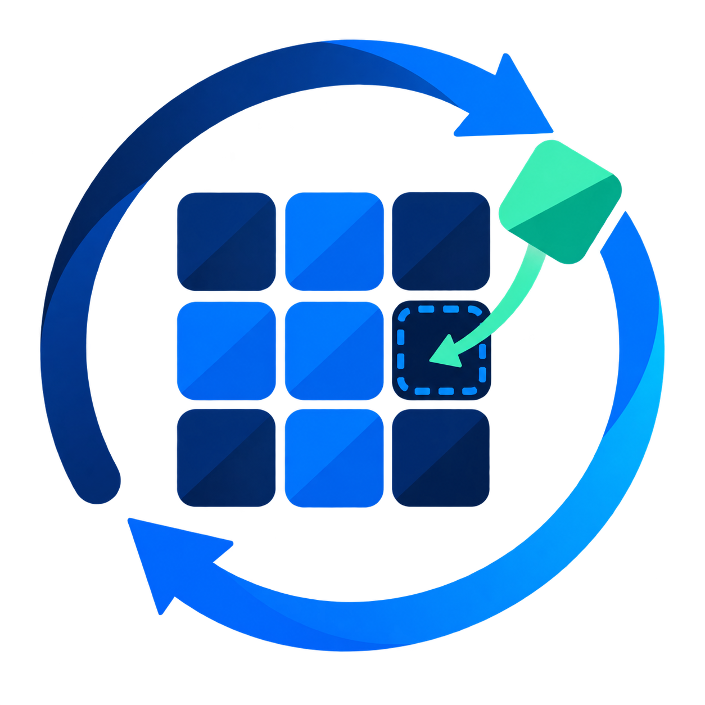
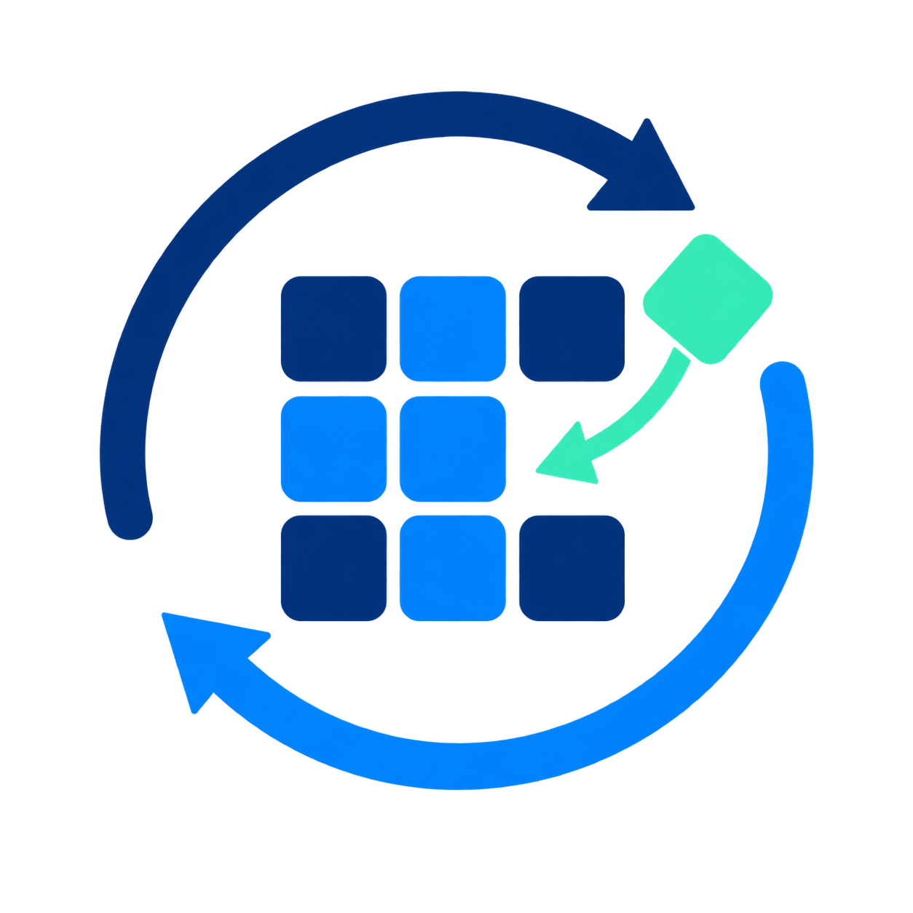

# WURepair logo concepts

These are the untouched original explorations, including directions that weren't selected. They are design history, not replacement product icons.

## Selected recovery ring

The recovery ring has a clearer silhouette at small sizes than the busier grid concepts. It remains the product identity.

The [selected master](../wurepair-selected-master.png) is an exact copy. Use the sized PNGs and ICO in [the brand folder](..) for production. [selection.json](selection.json) records the selection.

## Earlier directions

